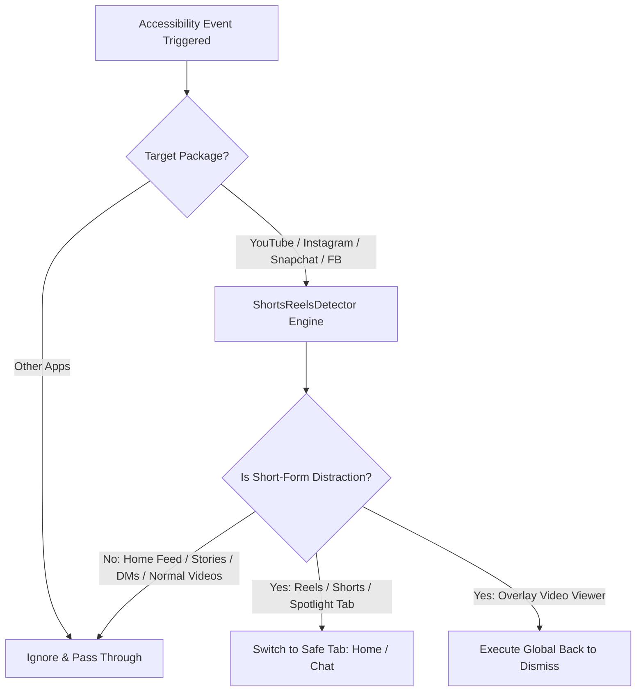

# FocusBlock 🛡️

> **Minimalist, 100% Offline & Zero-Data Short-Form Video Blocker for Android.**

FocusBlock is a lightweight, privacy-first Android application designed to help you reclaim your time and attention by instantly intercepting and blocking addictive short-form video loops (**YouTube Shorts**, **Instagram Reels**, **Snapchat Spotlight**, and **Facebook Reels**) without breaking standard app functionality.

---

## 🔒 100% Clean, Pure & Completely Offline (No Data Collection)

FocusBlock is engineered with a strict **Zero-Trust, Zero-Data & 100% Privacy** guarantee:

| Security Metric | Status | Details |
| :--- | :---: | :--- |
| **Internet Access** | ❌ **NONE** | `android.permission.INTERNET` is **not declared** in the app manifest. The app physically cannot connect to any server or transfer data. |
| **Data Collection** | ❌ **NONE** | Zero telemetry, zero analytics SDKs, zero user tracking, zero account requirements. |
| **Storage & Keylogging** | ❌ **NONE** | No access to photos, files, camera, microphone, or keystrokes. |
| **Dependencies** | ✅ **Official** | Built purely with official Google AndroidX and Material 3 components. |
| **Open Source** | ✅ **100% Pure** | All source code is completely open and auditable right here. |

---

## 🚀 How to Install & Use

### Step 1: Install the APK
1. Download or transfer the latest `app-release.apk` (or `app-debug.apk`) to your phone.
2. Tap the APK in your phone's **Files / Downloads** app to install.

### Step 2: Handle Play Protect Warning (Safe & Normal)
Because this app is installed directly via APK (sideloaded) and signed with an independent developer key rather than Google Play Store:
- When the Google Play Protect popup appears stating *"Blocked by Play Protect - Unrecognised Developer"*:
- Tap **"More details"** ➔ Tap **"Install anyway"**.
- *(Optional)* If your device completely blocks sideloading, you can open **Google Play Store** ➔ tap your **Profile Icon** ➔ **Play Protect** ➔ **Settings (⚙️ icon)** ➔ temporarily turn off *"Scan apps with Play Protect"*.

### Step 3: Enable Accessibility Service
1. Open **FocusBlock**.
2. Tap **"Enable Accessibility"** (or open Phone Settings ➔ Accessibility).
3. Find **FocusBlock Protection Service** and switch it **ON**.
4. *(For Android 13/14/15 users)*: If the setting says *"Restricted Setting"*:
   - Go to phone **Settings ➔ Apps ➔ FocusBlock**.
   - Tap the **3 vertical dots (⋮)** in the top right corner.
   - Select **"Allow restricted settings"** (verify with fingerprint/PIN).
   - Return to **Accessibility** and turn **FocusBlock Protection Service** ON.
5. In FocusBlock, keep the **Master Protection** toggle **ON**.

---

## ✨ Features & Platform Support

- **Instagram Reels**:
  - Blocks the dedicated Reels tab and fullscreen video popups.
  - **Guaranteed Safe**: Normal **Home Feed**, **Stories**, **Direct Messages (DMs)**, and **Search/Profile** remain 100% functional.
- **Snapchat Spotlight**:
  - Blocks the Spotlight tab and full-screen Spotlight loops.
  - **Guaranteed Safe**: **Camera**, **Chats**, **Friends list**, **Stories**, and **Maps** work completely normally.
- **YouTube Shorts & ReVanced**:
  - Blocks YouTube Shorts feed and Shorts bottom tab.
  - **Guaranteed Safe**: Normal long-form videos, search results, subscriptions, and playlists play without interruption.
- **Facebook Reels**:
  - Intercepts and blocks Facebook Reels viewer and dedicated short-video tabs.
- **Non-Destructive Safe Tab Redirection**:
  - Instead of force-closing the host app, FocusBlock smoothly redirects you back to the **Home** or **Chat** tab.
- **Ultra Battery Efficient**:
  - Lightweight event-driven engine with 40ms debounce and minimal accessibility flags.

---

## 🏗️ Architecture & How It Works



### Key Modules:
- [`ShortsReelsDetector.kt`](file:///c:/Users/shubh/Downloads/blocker/app/src/main/java/com/focusblock/app/detector/ShortsReelsDetector.kt): Multi-signal evaluation engine combining fast view ID lookups, selected tab detection, and BFS hierarchy traversal with strict whitelist safeguards for non-distracting features.
- [`FocusBlockAccessibilityService.kt`](file:///c:/Users/shubh/Downloads/blocker/app/src/main/java/com/focusblock/app/service/FocusBlockAccessibilityService.kt): Core accessibility event processor with debouncing, cooldown management, and non-destructive tab escape algorithms.
- [`PreferencesHelper.kt`](file:///c:/Users/shubh/Downloads/blocker/app/src/main/java/com/focusblock/app/data/PreferencesHelper.kt): Manages Master Protection ON/OFF state.
- [`MainActivity.kt`](file:///c:/Users/shubh/Downloads/blocker/app/src/main/java/com/focusblock/app/ui/MainActivity.kt): Clean Material 3 dashboard displaying real-time service status, quick settings link, and master toggle.

---

## 🛠️ Building From Source

### Requirements:
- Android SDK (API 35, min API 26 / Android 8.0+)
- JDK 17+
- Gradle 8.9+

### Build Debug APK:
```bash
./gradlew assembleDebug
```
Output: `app/build/outputs/apk/debug/app-debug.apk`

### Build Release APK:
```bash
./gradlew assembleRelease
```
Output: `app/build/outputs/apk/release/app-release.apk`

### Install via ADB:
```bash
adb install -r app/build/outputs/apk/release/app-release.apk
```

---

## 📄 License
Open source under the [MIT License](LICENSE).
